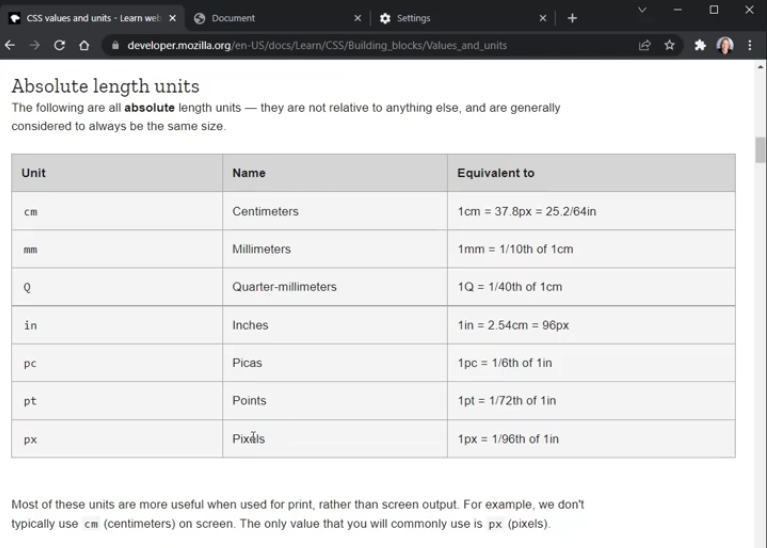
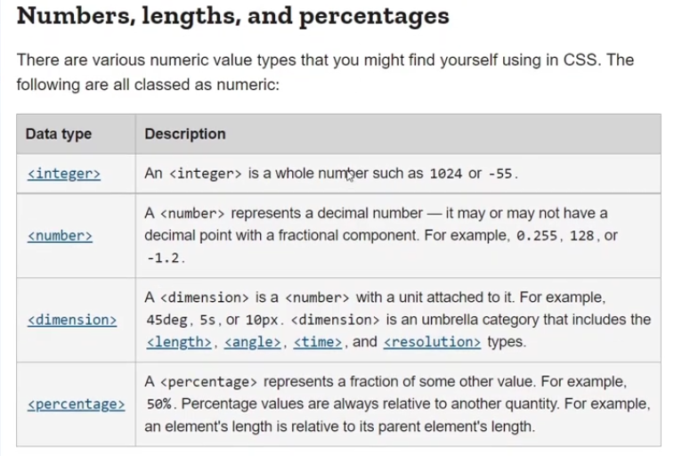
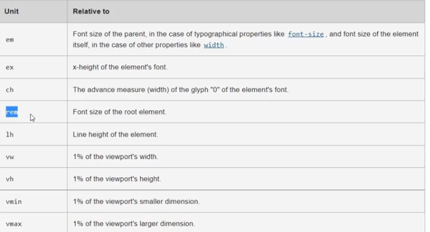
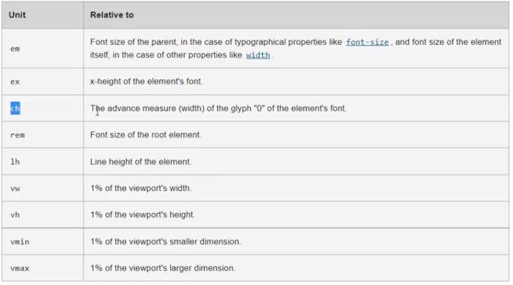
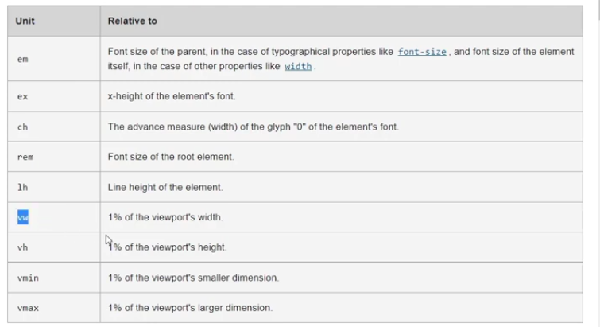
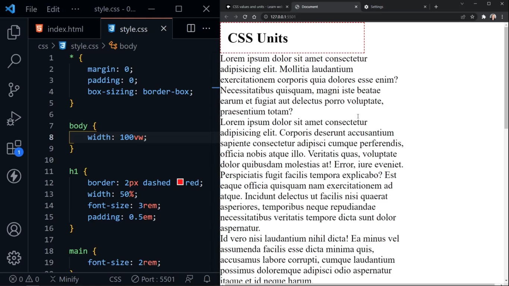
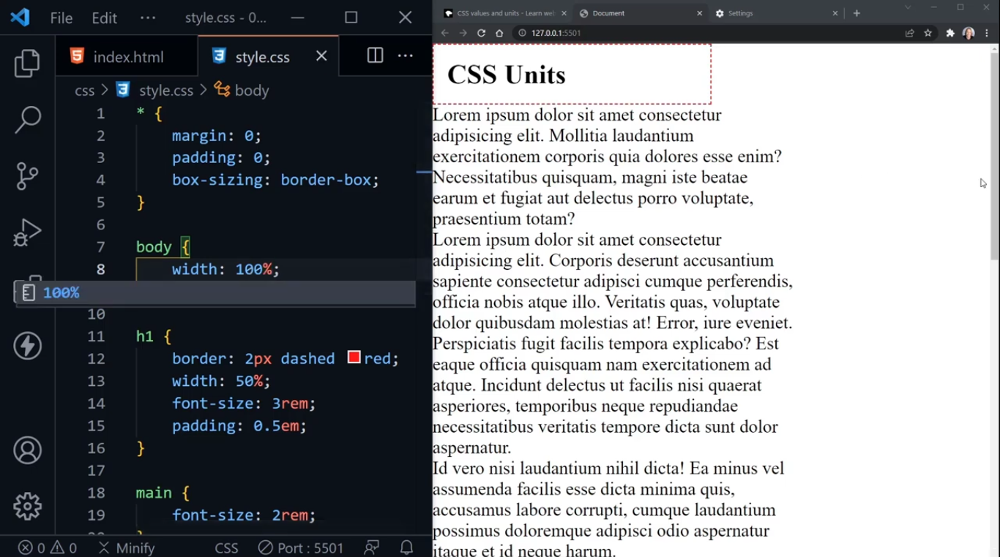
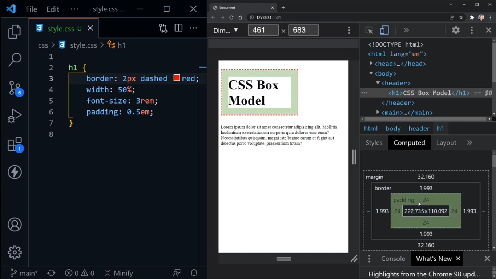

html = used to make structure of the web page

css = use to style or apply styling to html elements to make presentation more attractive

! + Enter = to create starter or basic structure of html page inside .html file

ways to apply css:
1. inline
write css inside opening tag of particular html element to apply only that element.

Example: //inside body section of .html file

I'm learning CSS!

2. internal
apply by creating css code inside head section of .html file inside  element.
Example:

3. external
create a .css file externally and write css code, then link inside head section inside .html file with <link> element.
Example:
//style.css
p{
    color: purple;
}

//index.html
<link rel="stylesheet" href="css/style.css">

Note:
- css applied according to the order it is written.
For Example: 
if a .html file use all types of css, then initially external css applied to html elements, then internal css and then inline css and if css is applied to same elements, then css applied first will be overridden by the later css.

So, there is no any concept of precedence but the thing that matters is the order in which css is applied.

precedence:
inline -> internal -> external css

=> Anatomy of CSS Rule:
p {
    font-size: 64px;
    color: purple;
}

p = selector
font-size: property
64px = property value
font-size:64px; = declaration
p{font-size:64;} = css Rule

==> CSS Selectors:
1. element selector: apply to one or more html elements directly

select all elements of the specified types

p{
    color: blue;
}

2. class selector:
start with "period" .

.gray{
    color:gray;
}

classes can be reused to more than one elements

they are more specific than selecting all paragraphs, they overrule to css applied to all elements of specific element like 
 and p with class

3. id selector:
mroe specific
use # with element name to apply css.

Note: It is recommended to use id's inside css, normally we use classes and element selectors to apply css and there are very rare cases where we apply id's.

h1, h2 = will apply to all elements separated by commas ","

h1 h2 = 
means h2 element inside h1,

it will apply styles to h2 inside h1 element.

apply styles to only h2

4. universal selector:
it will apply to all the elements of html/everything on the page

this selects everything

use this to reset the css

* {
    font-family: monospace;
}

==> Cascade: 
css works like a waterfall (top-down) means if I place another definition of same element, then later one will be applied  

classes are more specific than elements means if we place classes before or after the element then css of class will be applied than the css of element because classes has more specificity than elements.

==> Inheritance in CSS:
where an element or child element inherit properties from parent element
Example: 
body = parent of other elements
so, all other elements will inherit the properties of body (parent) element

typically anything related to font or typography is inherited like color, line height, alignment, fonts, typography.

something that is not inherited is like border etc.

* {} = is not the Inheritance, it is basically selecting all elements and applying style that is defined.

Inheritance is handy because it keeps use avoid from writing the repeated code. It keeps code DRY (Don't Repeat Yourself).

Something that is not inherited: 
- border
- form elements don't inherit font settings
To do this use: font: inherit;
Example:
button, input, textarea, select {
    font: inherit;
}

html, main, body = elements should only appear once per page.

==> specificity:
element selector: least specific
class selector: more specific than element
id selector: more specific than class and element

==> Sometimes something is not working and we are frustrated. So, do we figureout?
use !important after declaration
Example:
p {
    color: purple !important;
}

!important = overrides everything, use to indicate that the code is not well organized

You should only use it when you are well aware of CSS.

==> Specificity Calculator:
link: https://www.specificity.keegan.st

==> Colors in CSS:
 /* color:darkblue; */
    /* color: rgb(255, 0, 0); red*/
    /* color: rgb(0, 255, 0); green*/
    /* color: rgb(0, 0, 255); blue*/
    /* color: rgb(0, 0, 0); black */
    /* color: rgb(255, 255, 255); white*/

     /* color: rgb(0, 0, 255); blue paragraphs*/
    /* color: rgba (0, 0, 0, 1); completely dark 0% transparent  */
    /* color: rgba (0, 0, 0, 0); completely transparent 100% */
    /* color: rgba(0, 0, 0, 0.5); 50% transparent*/

    
    /* color: #000000; black or color: #000*/
    /* color: #ffffff; competely white or color: #fff */
    /* color: #ff0000; red or color: #f00;*/
    /* color: #00ff00; green or color: #0f0*/
    /* color: #0000ff; blue or color: #00f*/

=> Resources for Colors:
1. coolors.co
color palette generator
    - contrast checker tool 

2. webaim.org/resources/contrastchecker/
useful for checking accessibility features

==> CSS Units and Sizes:

=> Units: 
determine the size of everything on the page

1. Absolute Length Units:

px (pixels) is the only absolute length units that is used normally.

defautl browser font-size = 16. So, when we keep 
p {
    font-size: 16px;
}
it doesn't change but if we change the browser font size and then see the font-size on page, then it remains of 16px, becuase we explicitly said that it should be what we set but not of the size that browser set.

h1 {
    border: 2px dashed red;
}
this will make border around h1 and it keep border of the specified length anywhere irrespective of other things.

=> Numbers, lenths and percentages:

2. percentages:
they are always relative to another quantity like with respect to parent

3. rem:

relative to font size of **root element**

1rem = default (16px)
2rem = double the size of default of browser (2 * 16 = 32px)

em = (for font-size), it gets amplified.
so, main element is looking at the root, double that, p will look at the "main" element then double it according to parent.

h1 {
    border: 2px dashed red;
    width: 50%;
}

main {
    font-size: 2rem;
}

p {
    font-size: 1rem;
}

==> So, when we use "em" rather than "rem"?
- when need to set the size of paddding according to the font-size of its element.
h1{
    font-size: 3rem;
    padding: 0.5em;
}
here, 3rem = 3* 16 = 48
and   0.5 em = 0.5*48 = 24

- set the fontsize of button with rem and marign or padding with em

4. ch (character)

keep the certain width of character based upon the character size

p {
    width: 40ch;
}
means we only want 40 characters on line before line wraps up

use cases:
- helps in define columns

5. vw(viewport width) vh (viewport heigth):

It is the 1% of the viewport's width and 1% of the viewport's height.

main {
    width:50vw;
    background-color: skyblue;
}

set the width of the "main" is 50% of the width of the page and the paragraph text is going outside the width of the "main" element

use cases:
- 
if 100vw = problem occurs when the vertical content outgrows the page
Prolem: 
when the content goes outside the page, we know vertical scrollbar appears but in this case, also horizontal scrollbar appears as well which is the problem.

Solution: use 100% to only show vertical scrollbar

p*10>lorem = create 10 pargraphs of lorem ipsum text (random text)

sometimes, we want the height of the particular element should be what we specified rather than content it contains (normal way of increasing height)

use vh to set that.
body {
    min-height: 100vh;
}

==> Box Model:
everything in css is the box

margin ->border ->  padding -> actual content   

padding = space between content and border

border = outline around element, after padding and before margin

margin = space between one element to other element on the web page.

CSS reset:
* {
    margin: 0;
    padding: 0;
    box-sizing: content-box;
}

content-box = will keep the width that we assigned and add padding, border separately to calculate total width and height.

border-box = will add padding, border to the content size and then the total size will be what we assigned. In other words, padding and border will be part of the length and width and add no extra size with the size we assigned.

outline: is not calculated in the box model
outline-offset: 20px; (outside the border, 20px outline)
outline-offset: -20px; (inside the border, outline will be)

=> How to turn box into circle?

.circle {
    margin: 3rem auto;
    background-color: gold;
    width: 100px;
    height: 100px;
    border: 2px solid black;
    outline: 2px solid red;
    outline-offset: 0.25rem;
    border-radius: 50px;
}

Typography:

