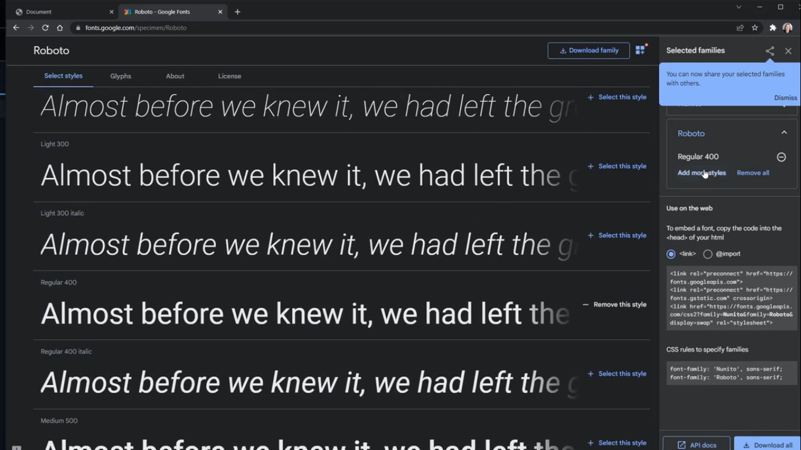
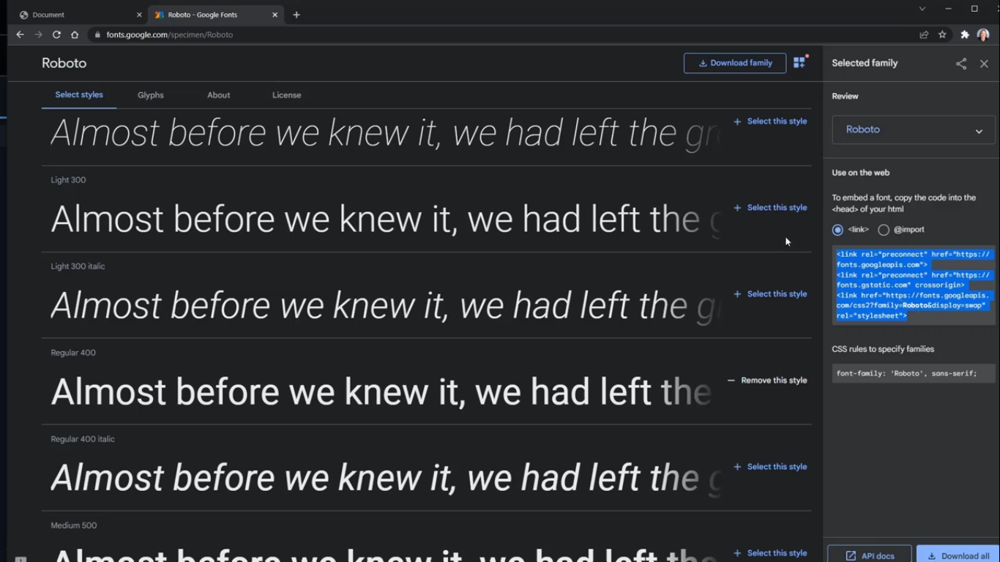
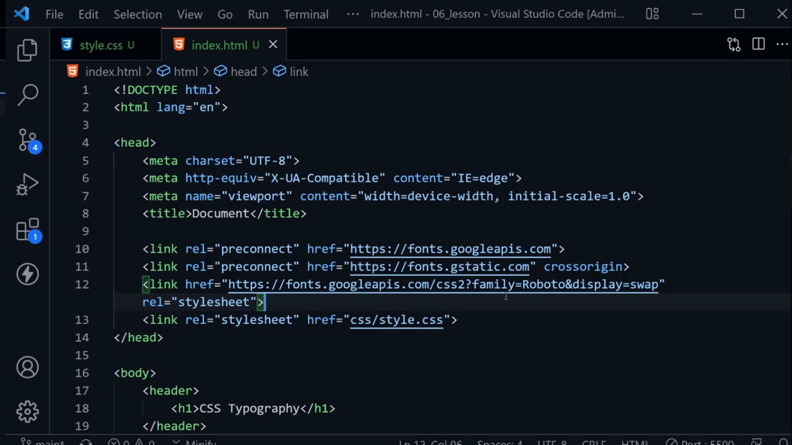
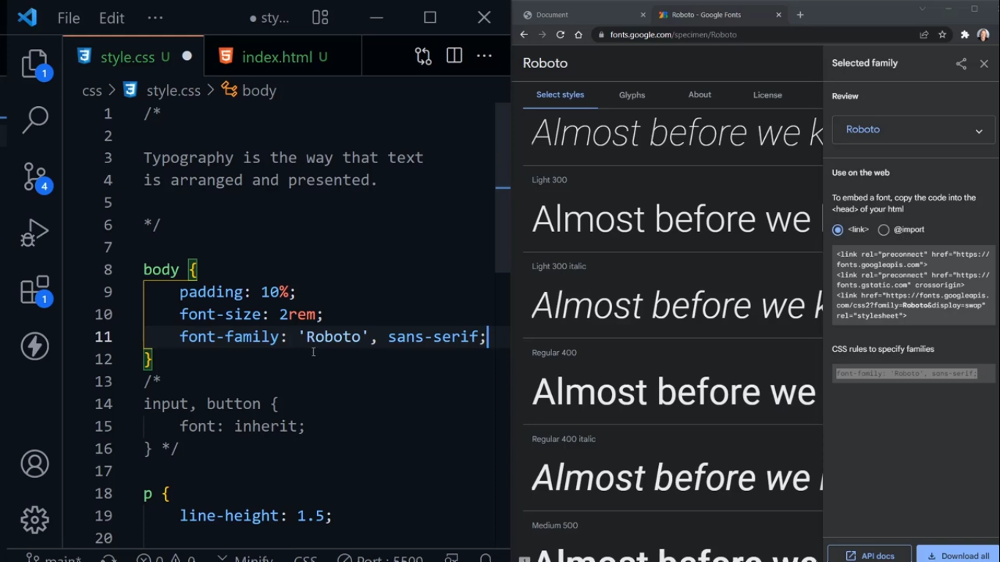
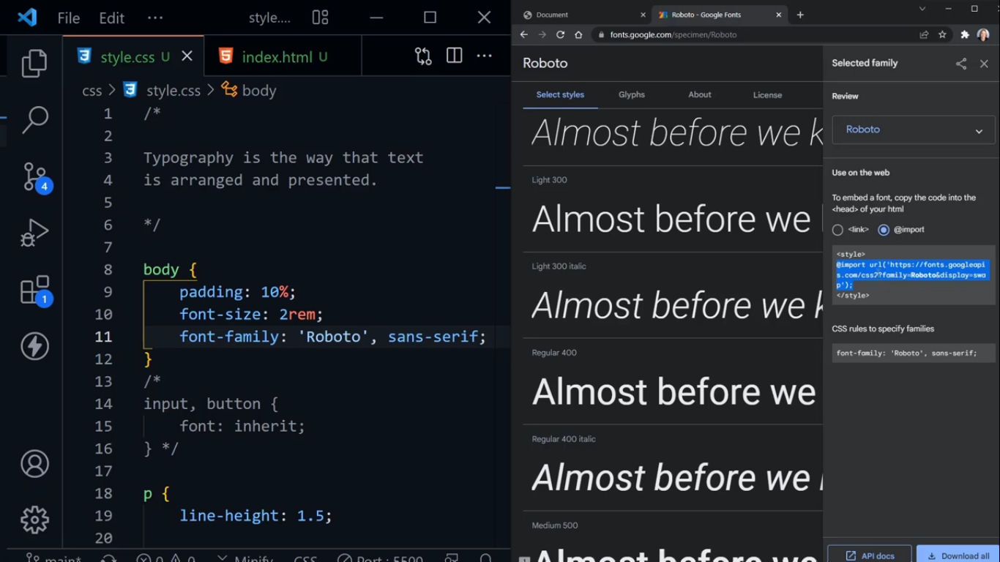
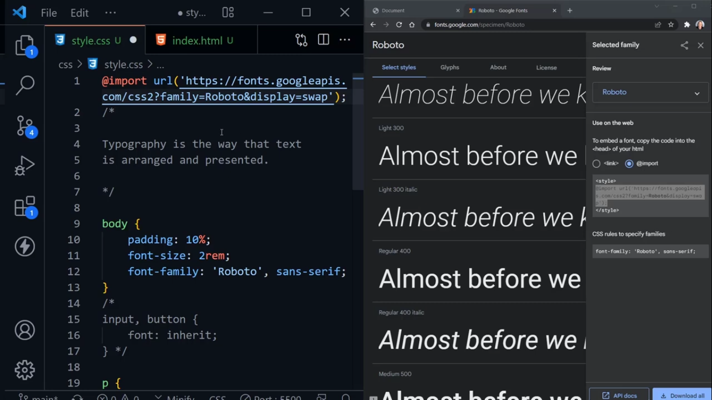

# Typography
- It is the **way that text is arranged and presented**

- Today, we will be working with **Text and Font** in CSS.

- We have already seen that by default font and text settings is being inherited from the parent but they **do not inherit inside of form**

- **text-decoration:line-through;** use where we need to cross something, in the same, we can use other properties as well.

- **text-decoration:none;** usefull when we want to remove underline from links which by default are underlined.

- **text-transform: capitalize;** will transform first letter into **capital**

- **text-transform: uppercase;** will capitilazie all text

- any time value has space between words, need to wrap them in quotes

- **Web Safe Fonts** not need to installed on the local but they are on the web and can be used.

## Font Resources:
- [Google Fonts][You will get google fonts]

[You will get google fonts]: https://www.fonts.google.com

### Very popular fonts:
- Roboto, contains 12 different styles

### How to Link into Web Pages:
- use **<link> in the head section** and them add css value to font-family inside .css file. 

- **Note:** the more we add google fonts or from web then the more page takes time to load. So, try to use them when used abosutely necessary.

- or **@import**

