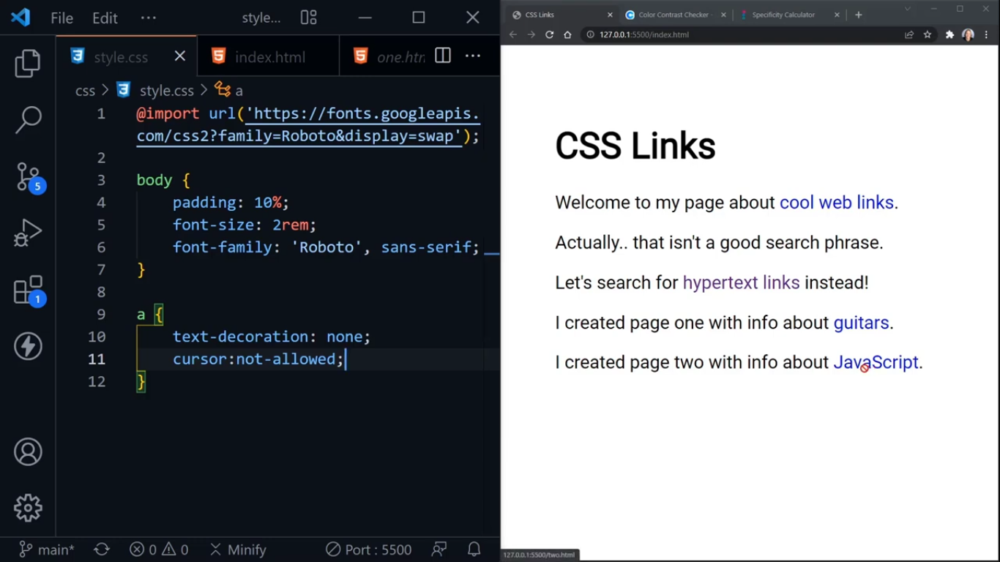
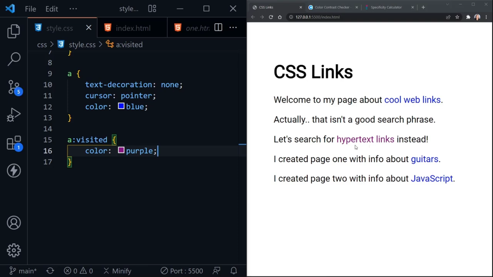
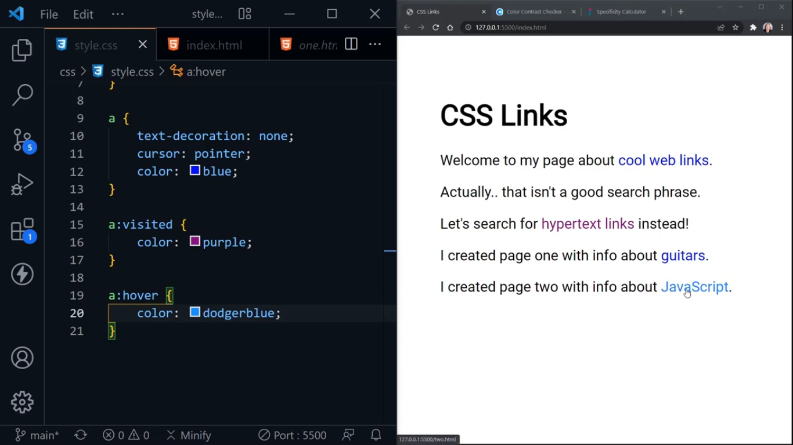
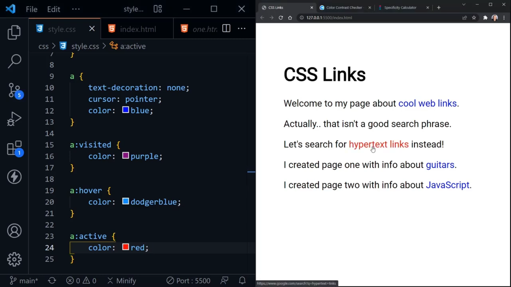
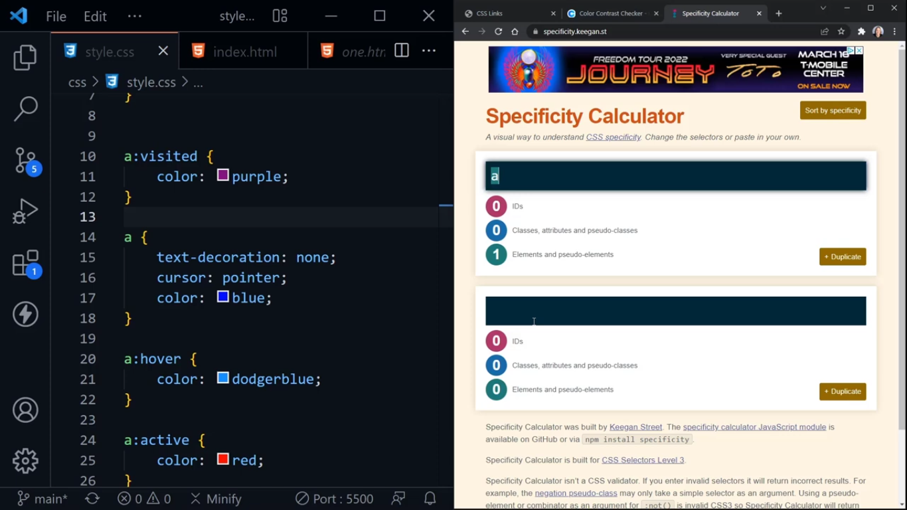
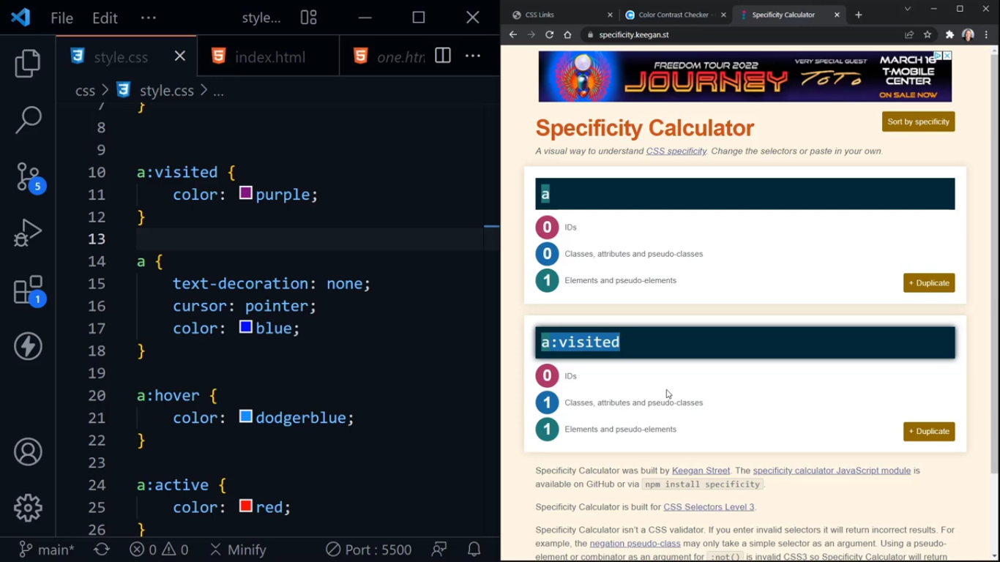
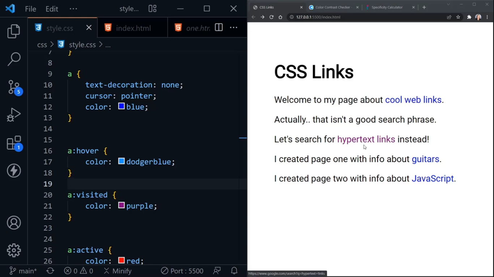
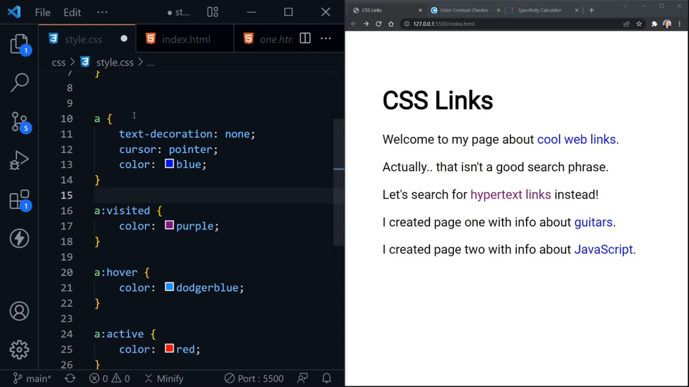
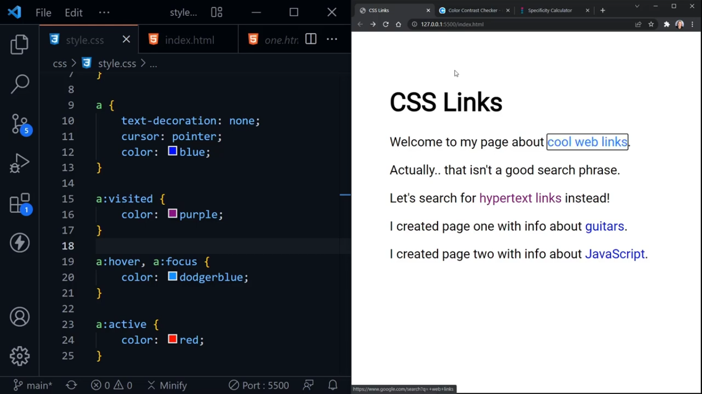
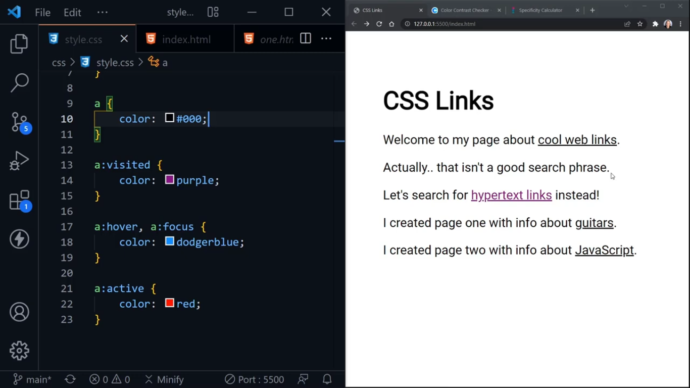

# Styling Links in CSS
- styling links is the part of **typography**

- when we talk about links, we talk about  **<a href="">anchor tags</a>**

## Default Styles in Links:
- they are **underlined**

- link in **blue color**, if it is **not visited**

- **visited links** are in **purpule color**

- when **hover over link**, it changes cursor to **hand** type

- when **click and press button** on the link, it turns into **red color** means link is active.

- **cursor:not-allowed;**

## Pseudo classes in CSS:
- we create them using **ele:pseu-class{declarations}**

- they represent the currnet state of the element because state of the anchor element can change like active, visited, and others.

- now, we need to consider the specificity and the order of the pseudo classes of link. 

### Specificity of Pseudo-classes:

- sequence of classes should be: **link -> visited -> hover -> active**

### Focus on Links:
- **a:focus**, users can use tab to get focus on links or select them using tab key of the keyboard. So, it helps in accessibility

### Black Links:

- sometimes, we often don't see the changes colors of visited links but the same color

### Way to get the Similar Color of Link and Hover:

- **Approach 01**: use hsl color in **a{}** and change the hsl value close to the color in hsl of **a**, then use see it goes with the same color theme.

- **Approach 02:**
use **opacity property** which make something transparent. we can use **opacity** in **main** element to change paragraphs text color or shade

-- **Approach 03:**
use **alpha channel in rgba(red,green,blue,alpha)** 

