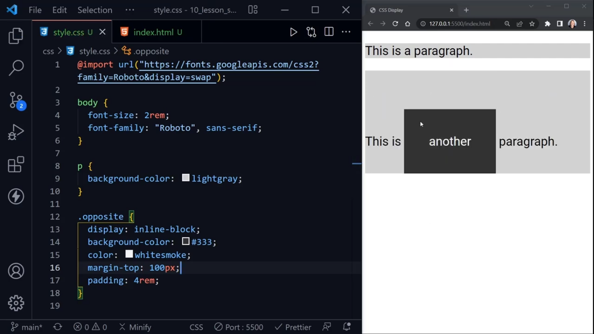

# CSS Display:
Two types of elements:
1. Inline
- occupy space that the content in the element has

2. Block-level
- takes all the width of the page and height size equal to the content height (100% width).
Examples:
-- p, main, 

- we can apply margin, padding, border to all four sides

## What we can and can't do with Inline Element?
- we can't apply top and bottom margin to inline element

- height can't be applied

- padding applied just a little bit differently like when we apply padding:4rem; it will override other paragraphs

- display:inline;
- display:block;
- display:inline-block; Now, it will not override other paragraphs, it is kind of hybrid of two becuase we can apply some properties of block level element to inline element by keeping it inline and look like a block, don't create new line, 

## Summary:
- block-level elements stack on top of each other and always create a new line while inline elements do not stack on each other and don't create a new line.

- block-level elements always has 100% width of whatever they have given if they are not inside something that is liminting their width while only take up the width of the content unless other properties applied like padding.

- when we switch to inline-block, we kind of get hybrid where we can keep the content inline but we can go ahead and apply a top and bottom margin or height and other things that typically only block-level elements have.

## When would inline-block will be handy?
- when we try to turn link into a button and sometimes people do this

- turning a list into a row instead of a vertical list. so, it would be horizontal. Lists are by inline elements but list items are block-level elements.
### Example:

