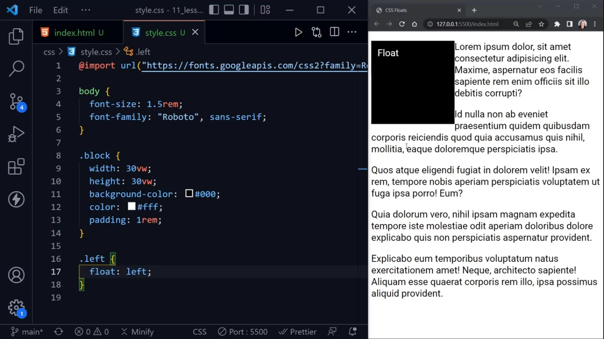
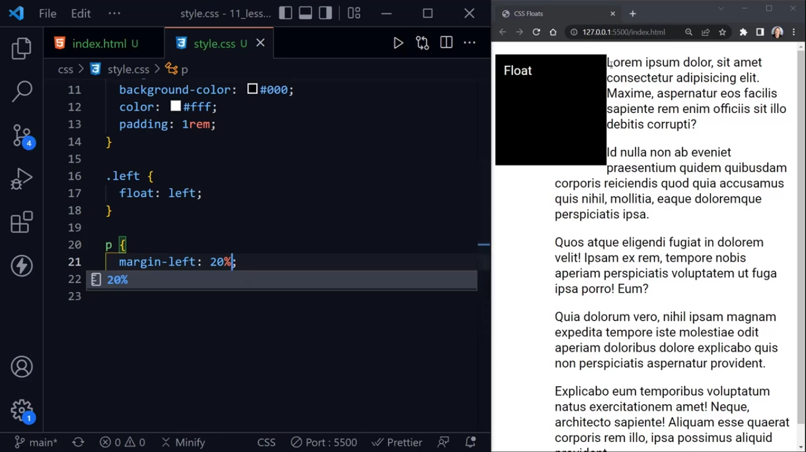
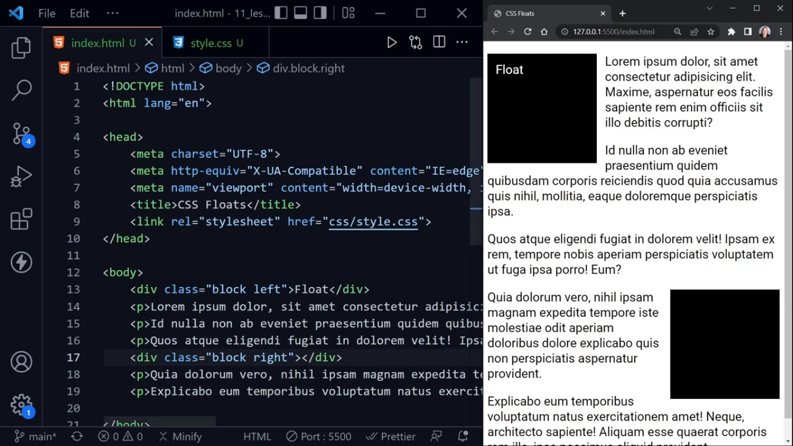
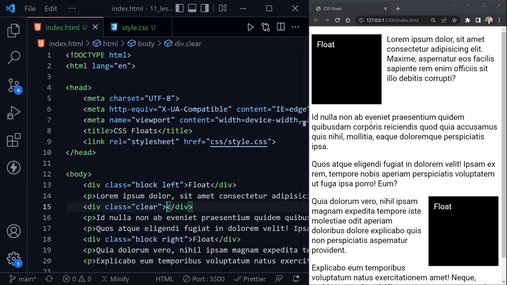
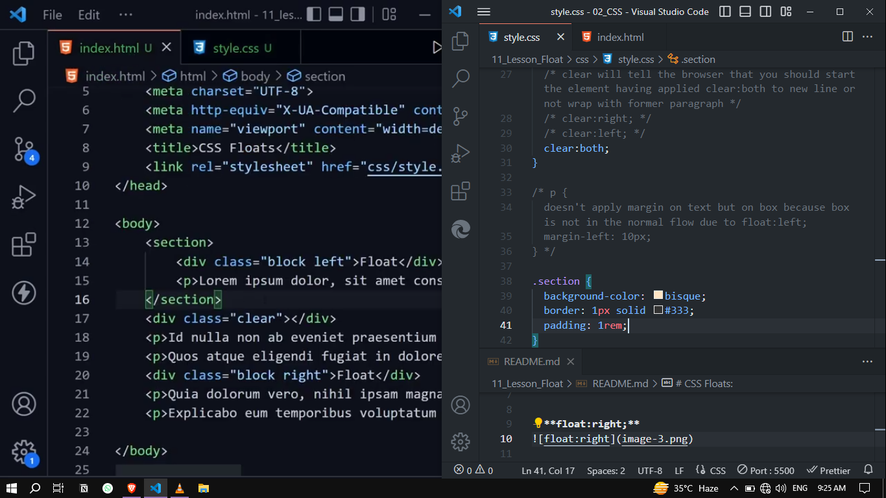
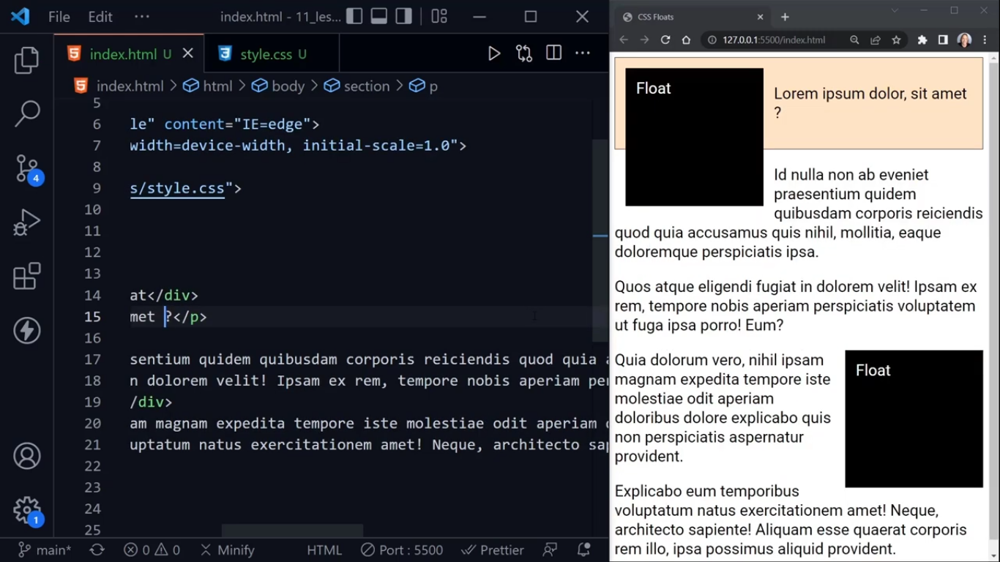

# CSS Floats:
- Floats are **used to float things left and right on any element** you want to and you **can wrap any text around it** and can also use **floats inside of container** but remember to apply **display:float-root;** to the container so the container can contain the full floated element and doesn't shrink based on the text content alone.

- **float:left;**

- **float:right;**

- **clear:both;**

- .section {
     background-color: bisque;
     border: 1px solid #333;
     padding: 1rem;
 }

    And, when shorten paragraph and remove div below it
        
Problem:
    

Solution:
- Approach 01: **overflow: auto;**. It will get the container element all the way down and increase the container with respect to box. It is kind of old approach.

- Approach 02: **display:float-root;** recommended by MDN. It is considered current modern way to fix the problem

- In the past, floats were also used to create columns on the page. But, it is oldest approach and now we have different modern way to create columns like css grid, flexbox etc.

