# CSS Columns:
- to create columns, need to use declaration:
**column-count: 4;**, it will create 4 columns and always will be 4 columns even though we increase or decrease screen size
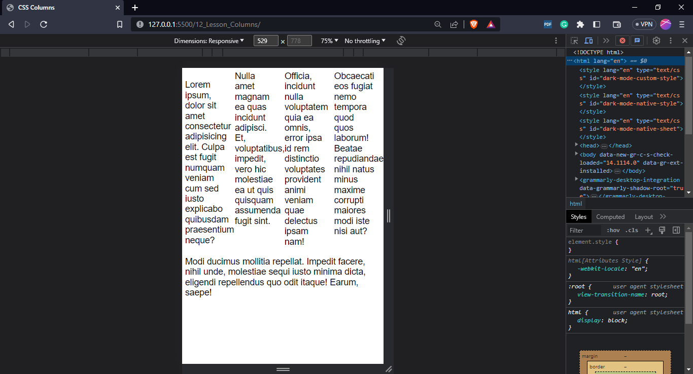

- But, if we want to manage columns numbers according to screen size, we need to set the width of column like **column-width:250px**
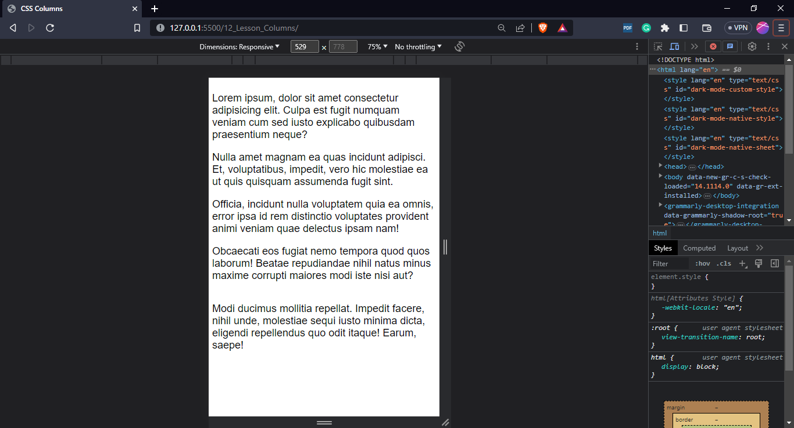

- create column divider/separator **column-rule: 3px solid #333**. Divider will not be shown when device size changes to one column.
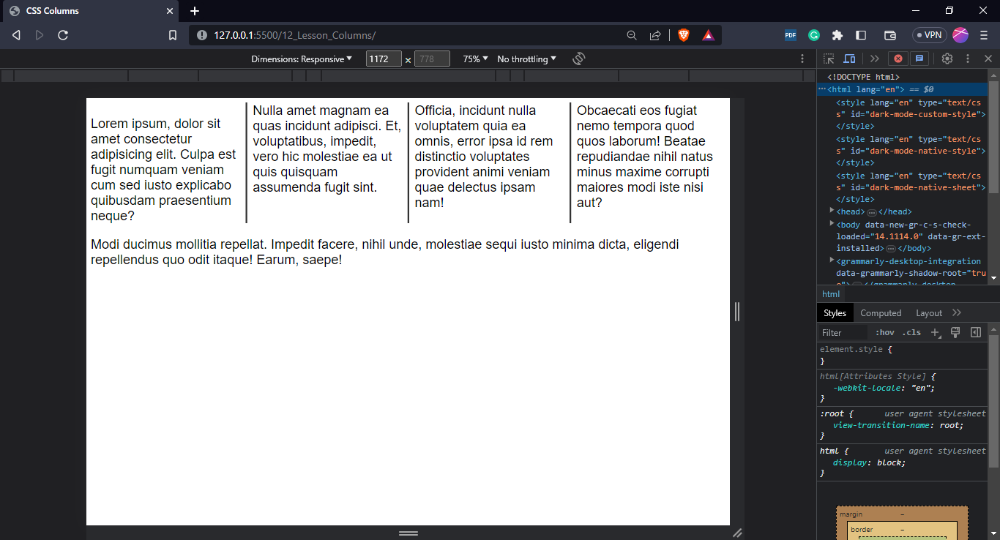

- spacing between columnn: **column-gap: 3rem**
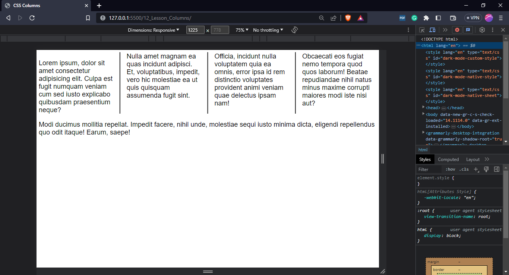

## Problem:
- Spacing issue between columns like first column has top and bottom margin but second column has only bottom margin etc.

## Solution: 
- use **margin-top: 0;** to **.columns p {}** and now the margin top of each column is removed but spacing between columns is still there. So, that is **Margin Collapsing**

- **Margin Collapsing**: So, it is not going to double up the margin between the second and the third paragraph by just having **bottom margin on 1st column** and and the **top margin on the 2nd one**
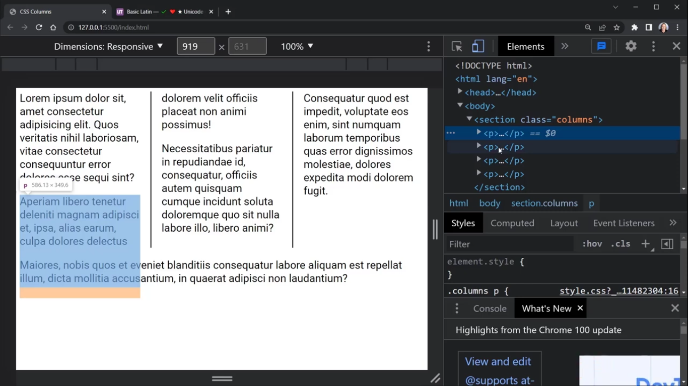

## Problem when add h1 between paragraphs:
- add new topic **h1**
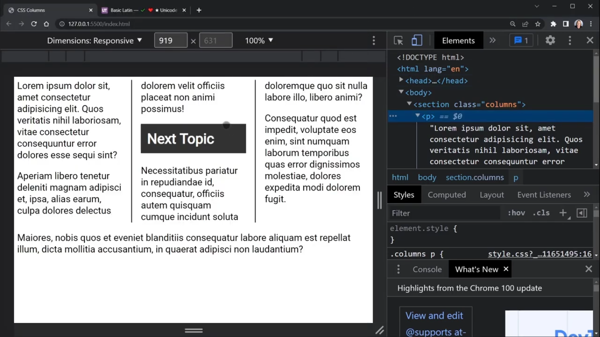
when resize the screen
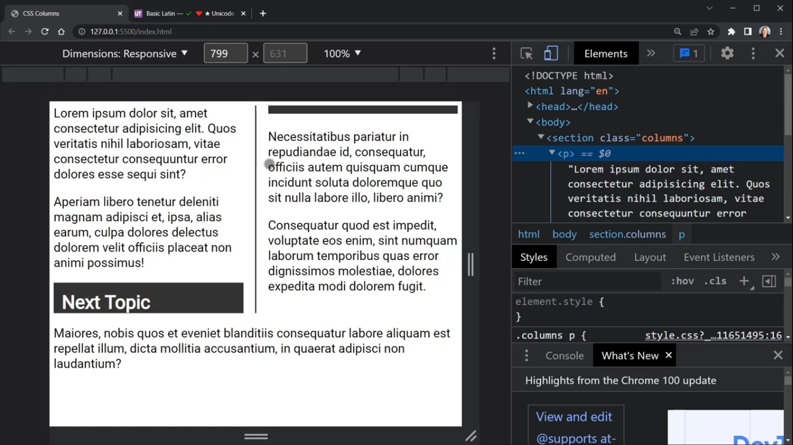

## Solution:
- when add **break-inside:avoid;** to h1
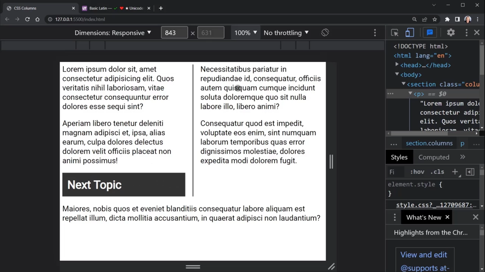

## Problem:
- when add property **break-before: column;**, forces to column break, to keep h1 on the top of column instead of bottom of the column when screen size changes. But, it will hightlight a problem: it will go down to three columns when screen size change to smaller **of one column** as shown below
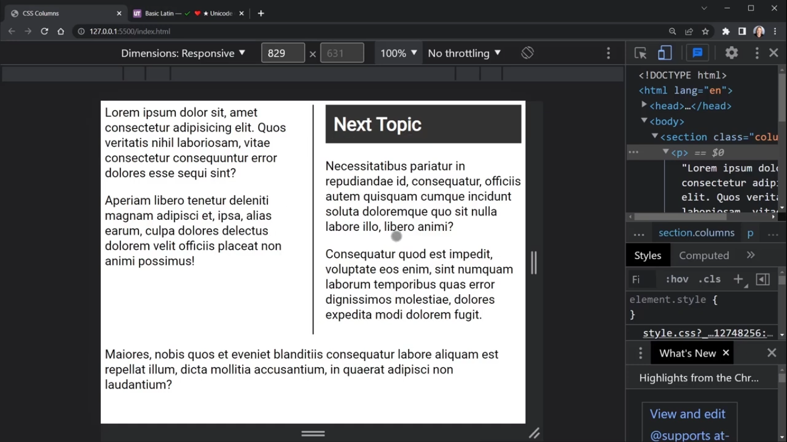
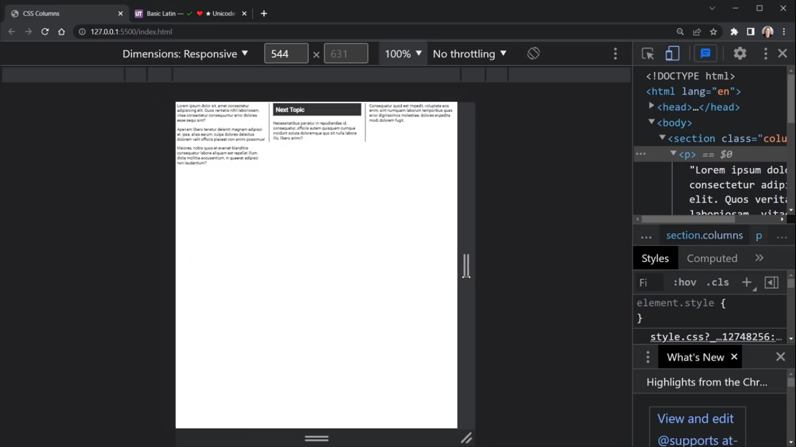

## Solution:
- so, try to avoid **break-inside:column; property** if you know to shrink screen size. But, **break-inside: avoid;** will avoid h1 from splitting into more than one column

## Resources:
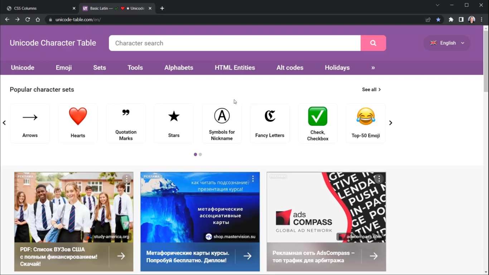

1. Unicode Character Table (unicode.table.com/)
- It let us look other character like html entities, unicode characters and there are different ways to provide those different characters in our project by pasting those codes and in response we get those characters.

- creating quote: use html code and apply css
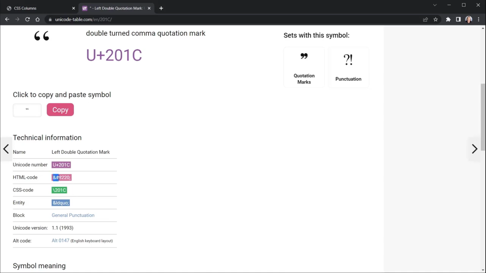
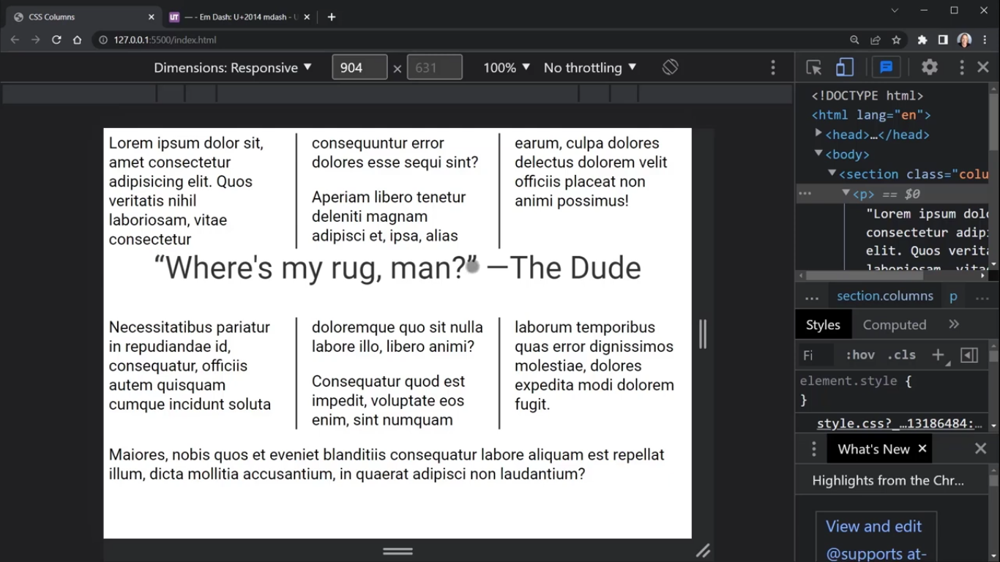

## Problem:
- we have top margin is 0. so let's add top margin to quote **marign-top:2rem;**, but no change in output due to specificity problem
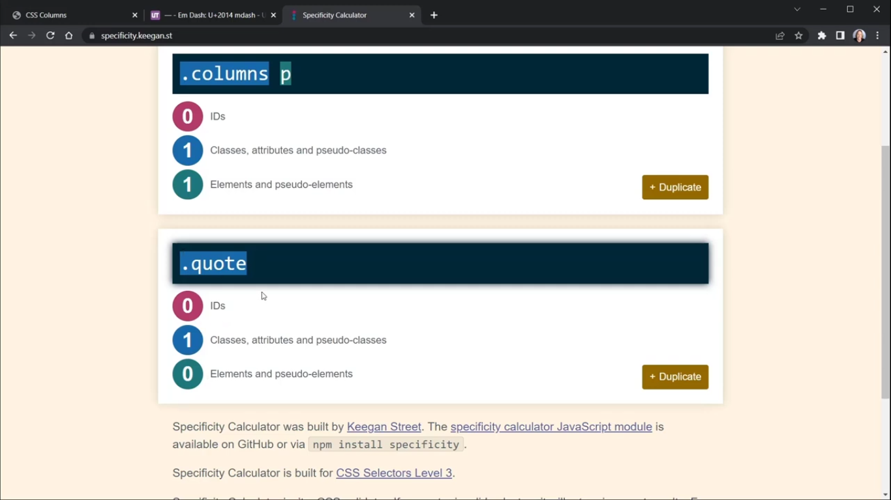

## Solution:
**.columns .quote** and then apply **margin-top:2rem**
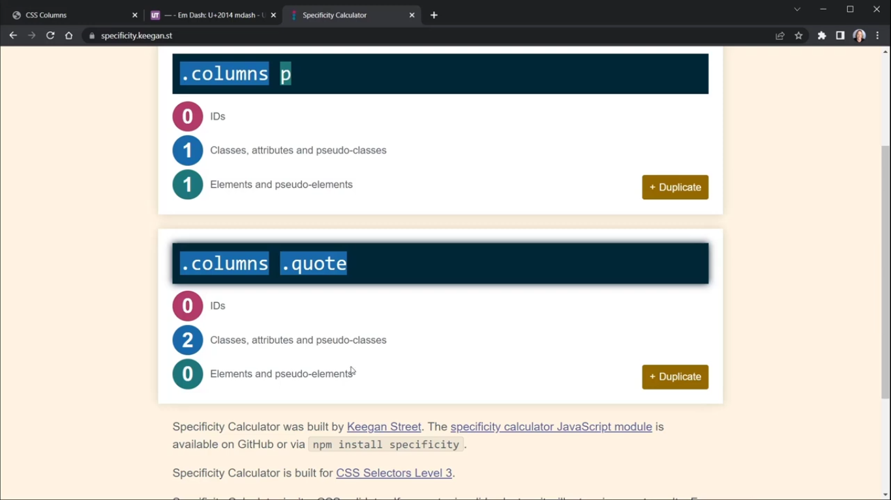
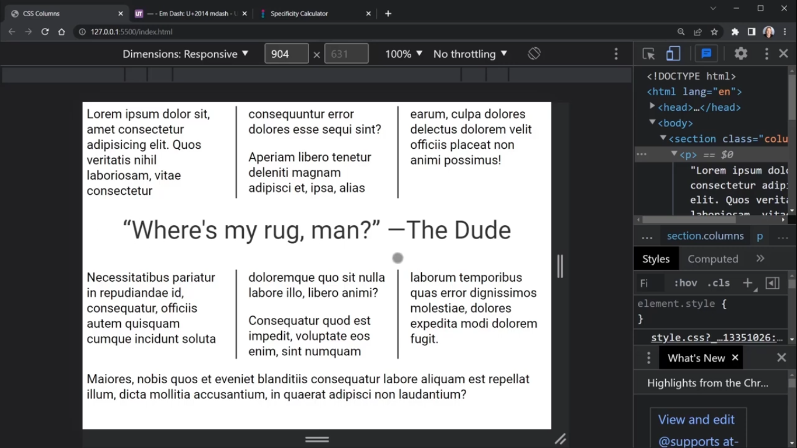

## Problem:
- when we resize the screen size, author name breaks to different lines
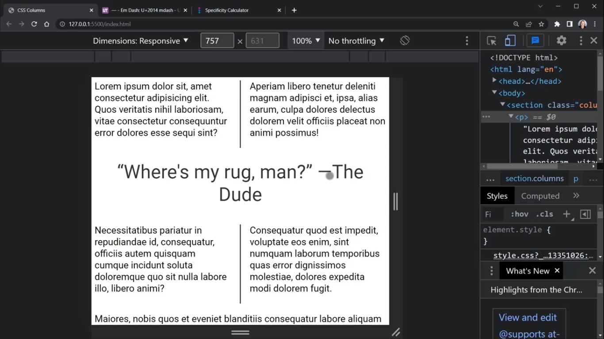

## Solution:
- wrap author name into ****, add class **nowrap** and then apply css **white-space:nowrap**. And, now author name will always be on new line rather than breaking-up name words.
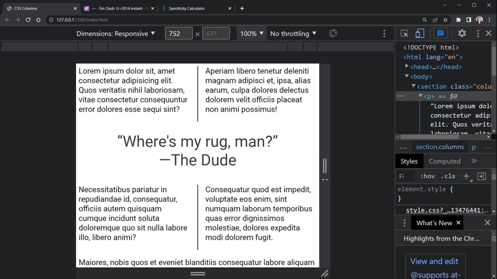