# Position in CSS:
- main 4 properties of position in css:
1. Absolute
2. Relative
3. Fixed
4. Sticky

## Position:Sticky;
- **sticky** is the default of all elements. keep elements static on page.
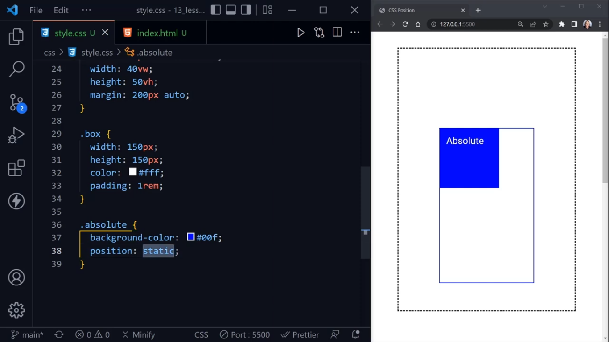

## Position: Absolute
- **absolute**, can get value *top*, *left*, *right*, *bottom* to change its position and see the effect of absolute positioning.
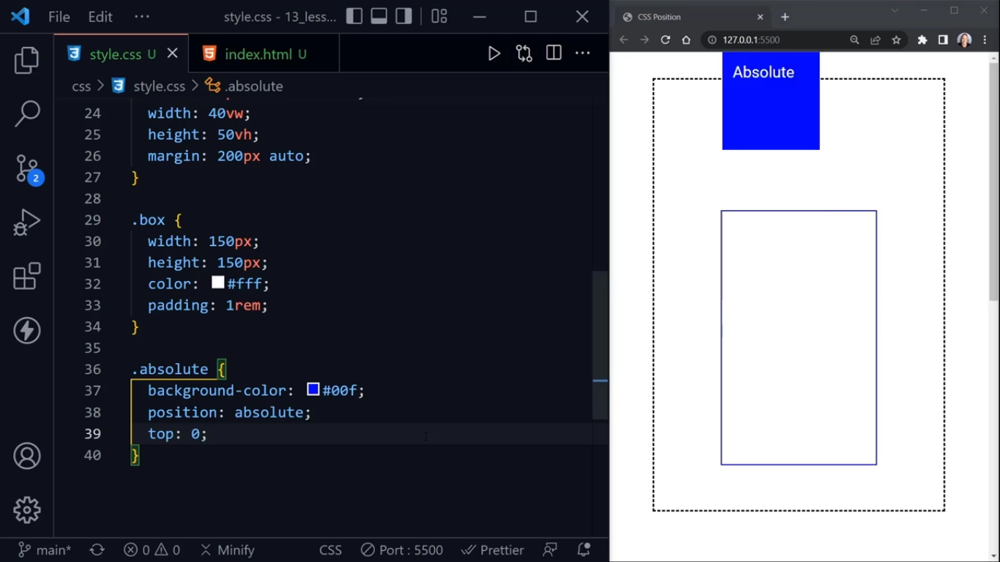

- So, absolute positioning needs a relative parent and if it doesn't have any anscestor element that is positioned relative then it takes the initiall boundary or initial box (here browser window)
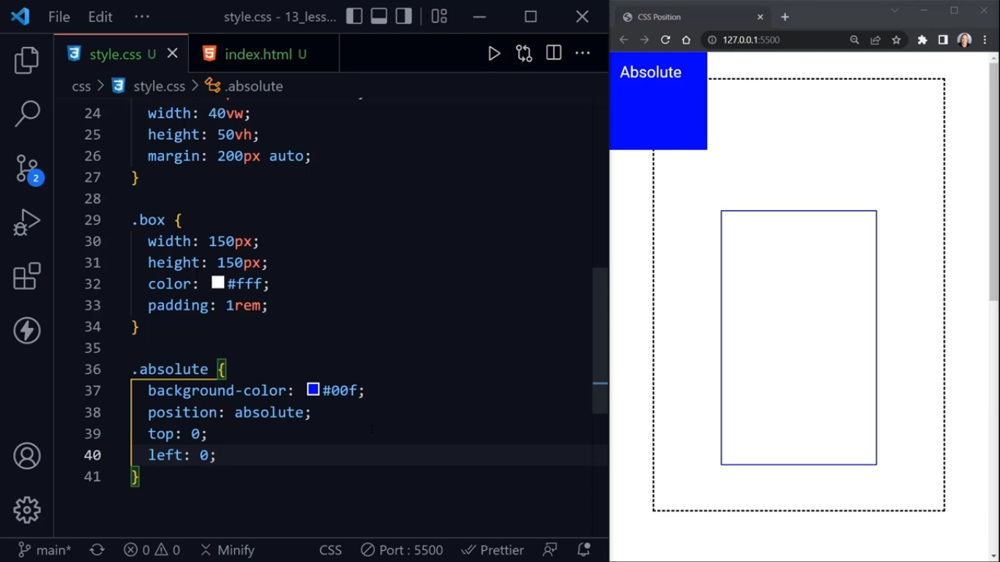

- now, set position on outer container **position:relative** to .outer-contianer, then it moves to the top of its parent (outer container) having position relative.
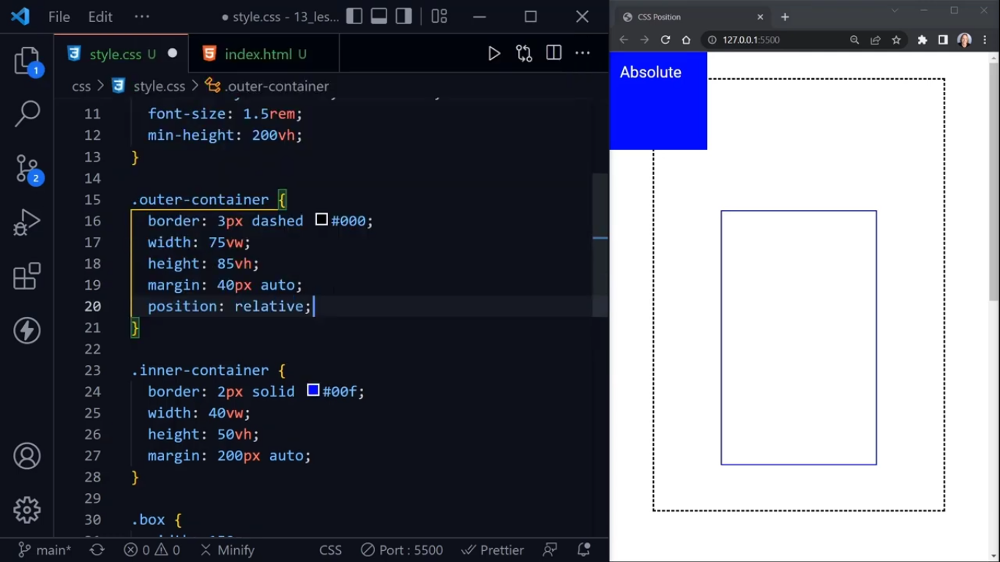

- But, what if we set the **position:relative** to more than one anscestor, then it will set its position to the nearest anscestor as show below:
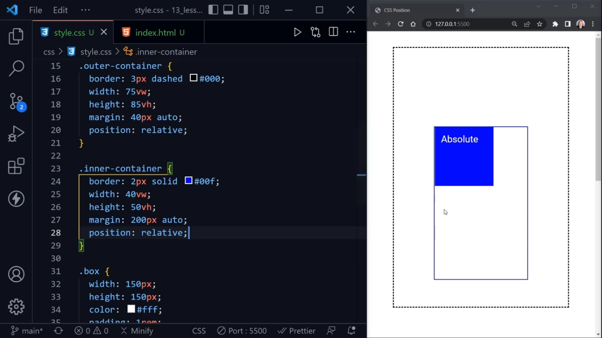

- when **top:100px;** and **left:50px:**, it will moved to the top and left from nearest anscestor (inner-container)
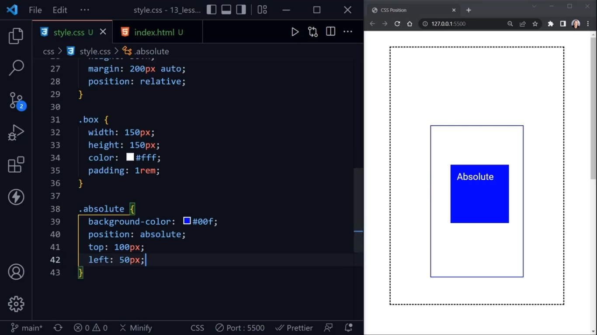

## Position:Relative
- It will be relative to parent container without having defining to relative parent

- **position:relative** will keep it's position relative to it's parent. When **top:100px** and **left:100px**, it's position will be changed w.r.t to it's relative parent.
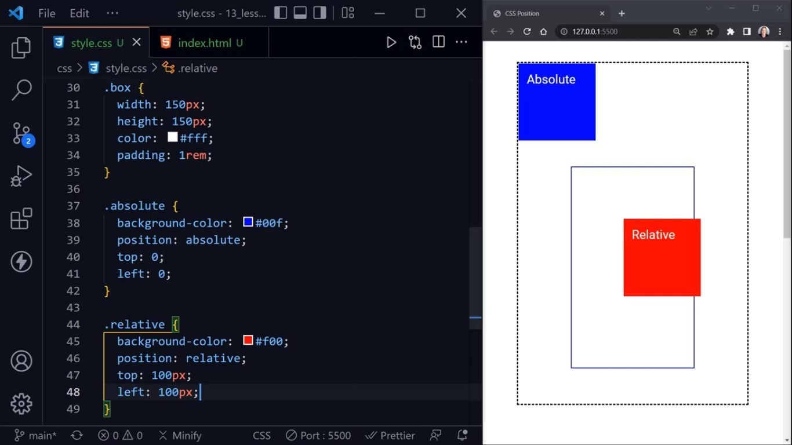

## Positon:fixed
- it will stay in fixed position on the page and will be on its position even though we scrooldown the page and box is not moving
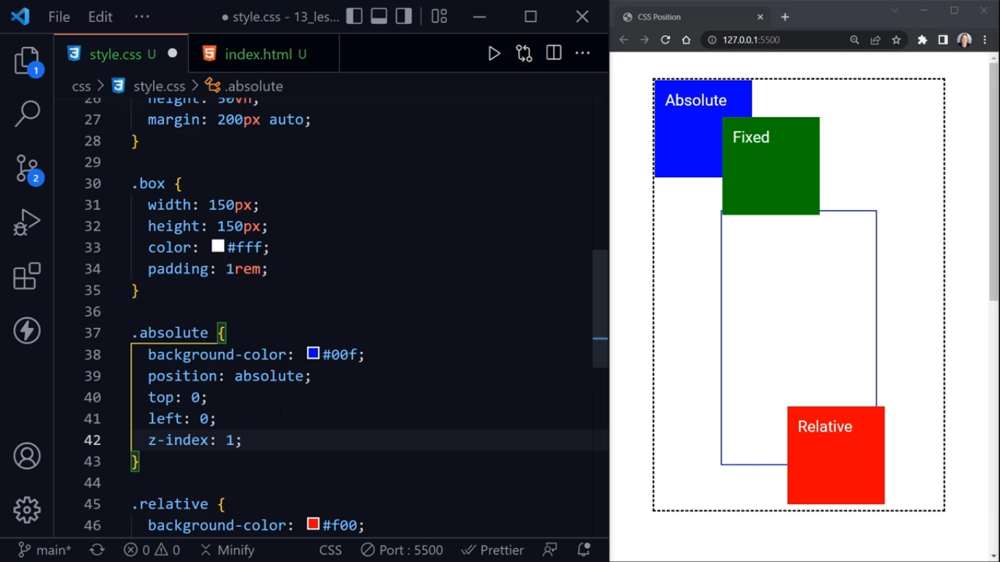

## Position:sticky
- will stay in normal untill the stop that you have defined
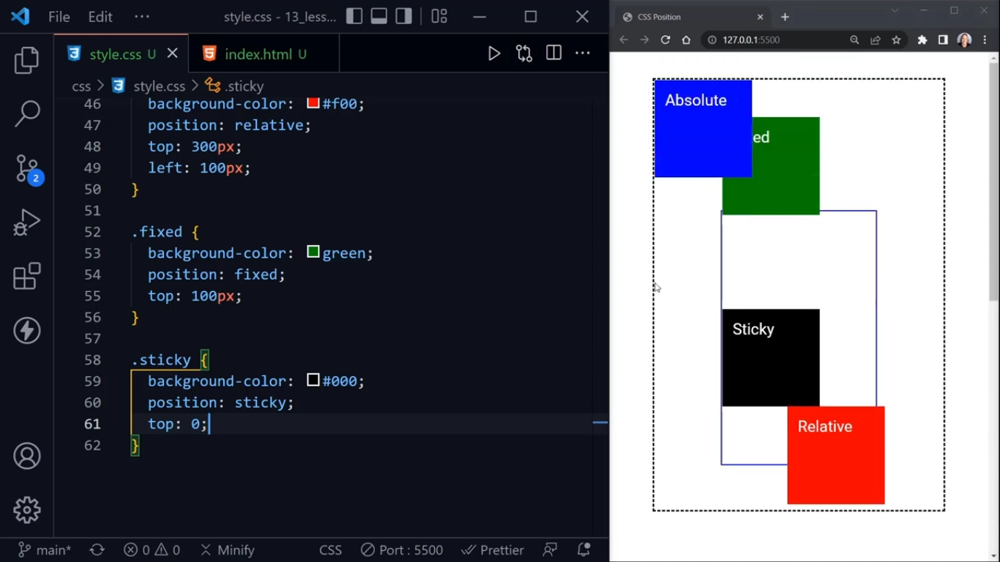

- when you need something to remove visibilly from the page but I still needed to be the part of the page for accessibility reasons, I position it **absolute** and I move it to a random number like **left:10000px;** and keep **position:absolute;**
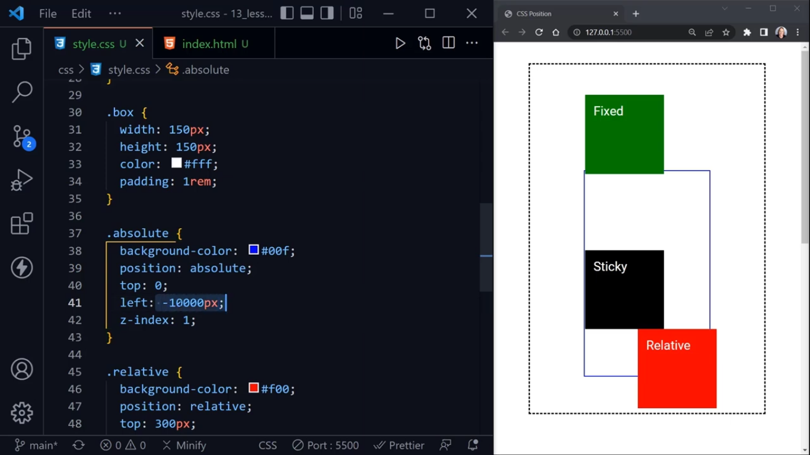

## Another Example:
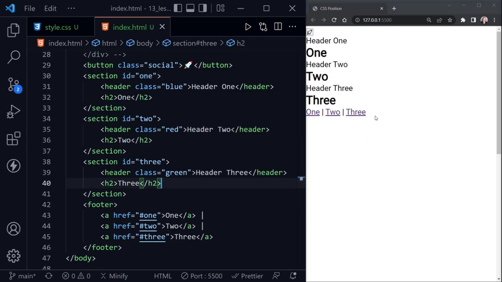

- **scroll-behavior: smooth** will make the behavior of moving specific part of the page in a smotther and nicer way.