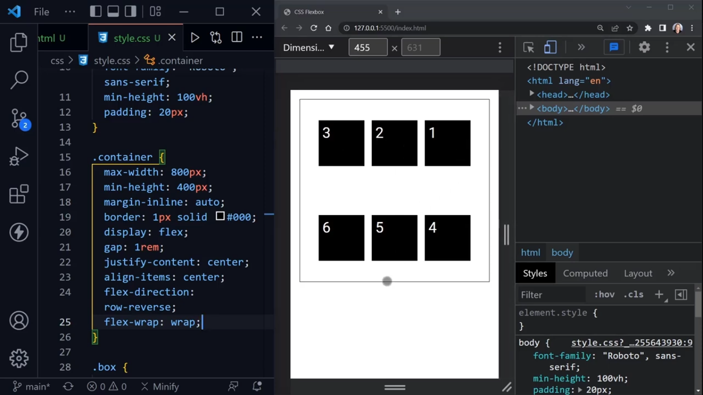

# CSS Flexbox Fundamentals:
- **div** is block-level element and that's why they take the full width of the page and they are stacked on top of each other

- **margin-inline: auto;** make sure to have same amount of margin on left and right and centered horizontally

## Steps:
1. need to make the container as flex container

### Align Divs/Columns Horizontally
- **justify-content:flex-start;** to start items from left to right

- **justify-content:flex-end** to start columns from right.

## Overflow Problem occurs in columns when resize screen
 

 

 ## Handle the properties of individual box insdie container:

 ## Resources:
 1. Flexbox Froggy (flexboxfroggy.com)
 

 