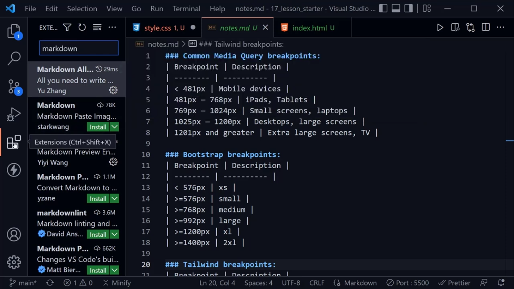
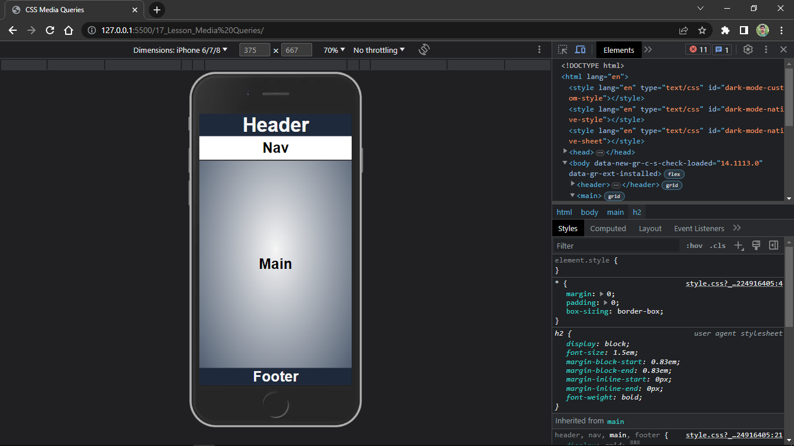

# Media Queries:
- It allows to modify your site based upon specific characteristics and parameters and most often we look at browser viewport width

- this is key to responsive design as our web pages are respond to the width of the device viewport

## Syntax of Media Queries:
- *@media media type and/or (condition:breakpoint) {
     CSS Rules
 }*

- **media type: screen**, it is the most common media type and others are *all, print, speech* for screen readers

- **min-width**, you should read it as **starting from** likewise **max-width** means maximum width upto. But, we usually do this from *min width* becuase we design from the smallest to the largest and that is called **mobile first** design or responsive design and it is also easy to work from smallest and go to the largest rahter than starting from large complex thing and then make it smaller.

- We start from **mobile screen** also called one-column design

## some of the other conditions and breakpoints instead of min-width
- **orientation: landscape** (change orientation). 

- **min-aspect-ratio: set-ratio** where at set-ratio can of any size like
    - min-aspect-ratio: 16/9 where width:16 and height:4
    - min-aspect-ratio: 7/4
 applied to any thing that is wider than tall

 ## How we decide what breakpoints we use and what values we apply
There are some common breakpoints and values

### Extension:
- **Markdown All in one** is a extension that helps in out to preiew the Markdown text.

- After adding, press **Ctrl+Shift+V** to preview it. So this is how github read our markdown.

- we can make or set breakpoints according to the need to page responsiveness or follow officially set breakpoints by CSS, Bootstrap or Tailwind CSS (CSS Framework)

## Outputs:

