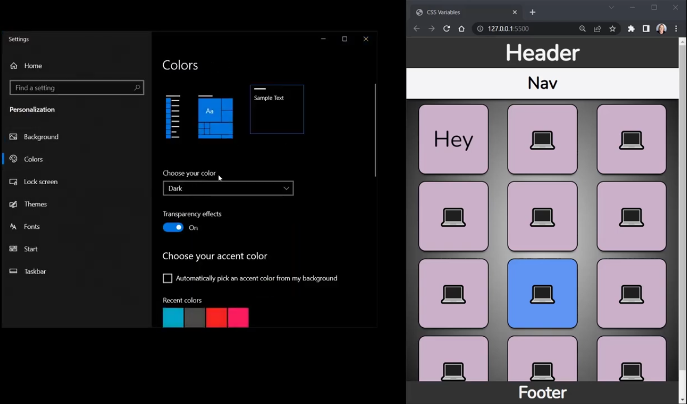
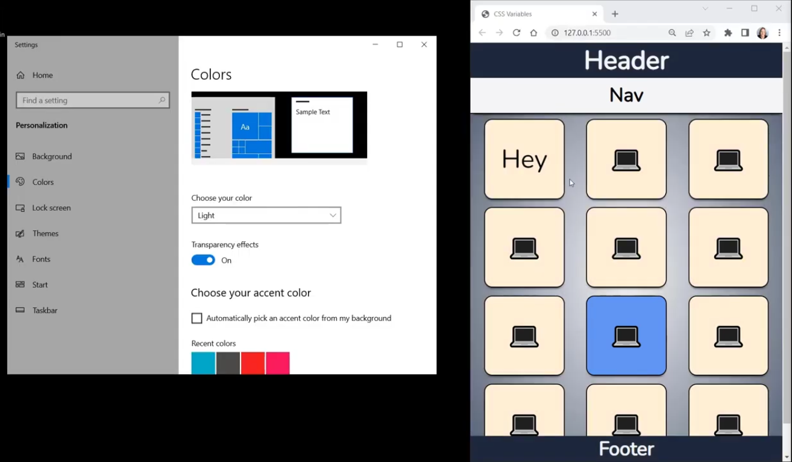

# CSS Variables:
- they are very very useful

- Imagine you have very project where you use hexadecimal color codes in many different places. Now, your boss says, change that particular color to another color. Then you have to go to each place and change color code at every place. To make this approach more efficient, use **CSS Variables** where you need to only specify a variable and then use that variable where you need.

## Setup Custom Dark Mode with CSS:
- first we define custom css for dark mode
- then, web page will chage it's mode based upon the type of color mode our system is *light* or *dark* mode

