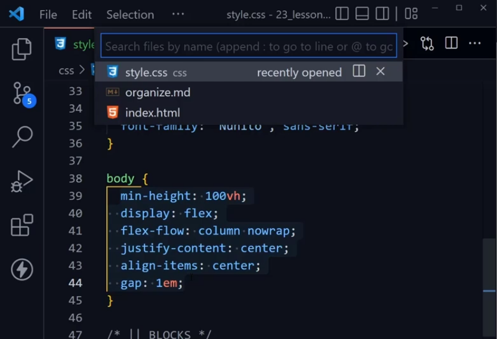
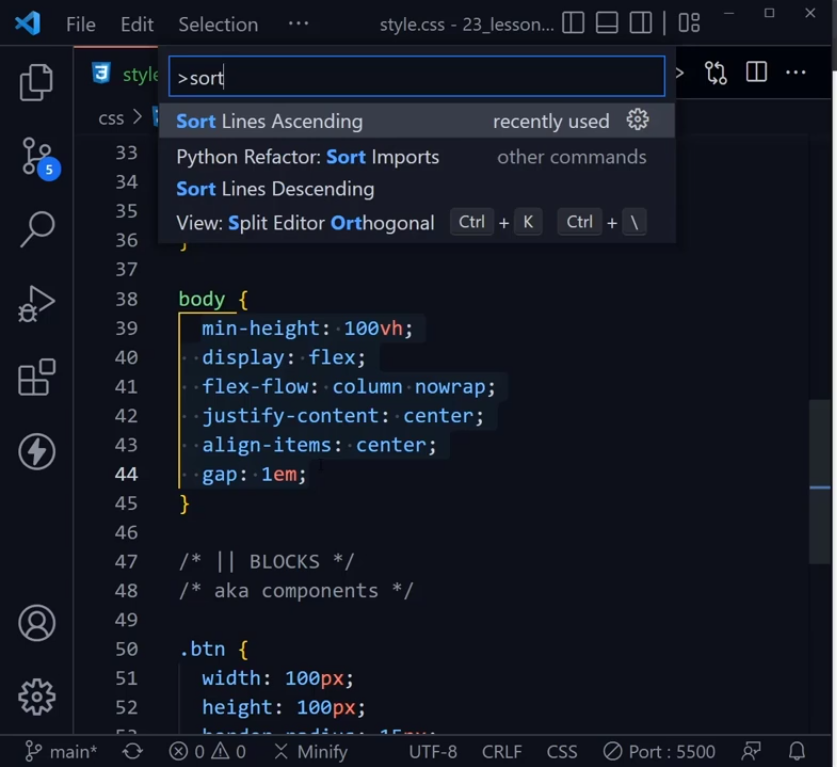
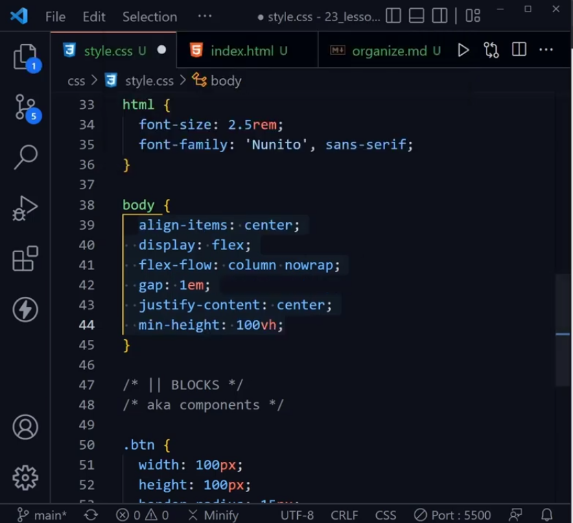

# Suggestions to Organize Your CSS

- Follow Your Team

- Use comments to create header/labels

- Sort properties alphabetically (normally) or in groups i.e. ABCSS. Select all the properties, press *Ctrl+P* to open command pallete and then *>* and then type the word *sort* to select *Sort Lines Ascending*

- For larger projects that has naming convention methodology, a popular naming convention methodlogy is: BEM - Block, Element, Modifier

- Elements going to have **__** two underscores
- Modifiers going to have **--** two hyphens
- Blocks going to be **class defined** like header or .btn for button 

- class has the specificity of *10*
- element has the specificity is *1*
- class with element has the specifity *11*